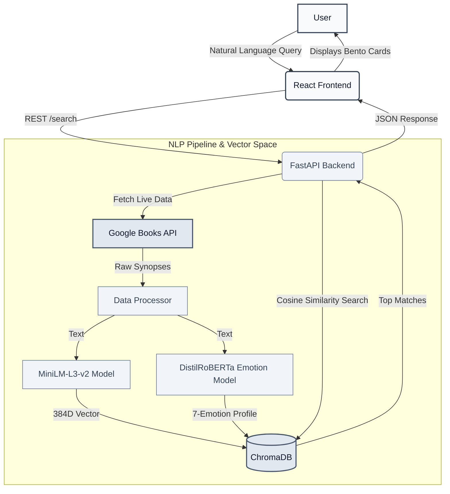

# **BookSense** 

## Overview
Traditional book recommendation systems rely heavily on rigid metadata: titles, authors, and strict genre categorizations. However, readers often search for books based on abstract concepts, specific atmospheric moods, or emotional trajectories (e.g., "A dystopian sci-fi with a melancholic, rainy atmosphere and deep existential dread"). 

**BookSense** was built to bridge this gap. It is a full-stack, AI-powered semantic search engine that leverages Natural Language Processing (NLP) to retrieve literature based on the *emotional* and *atmospheric* context of a user's query rather than simple keyword matching.

## Live Demo
[Try it Live → https://semantic-book-recommender-five.vercel.app/](https://semantic-book-recommender-five.vercel.app/)

## Key Features
- **Vibe-Based Search:** Search for books using natural language ("a cozy rainy mystery").
- **7-Vector Emotion Profiling:** Books are analyzed across 7 specific emotional axes.
- **Dynamic Corpus Expansion:** Live synchronization with the Google Books API.
- **Sub-Second Vector Search:** Instantaneous semantic matching via local ChromaDB.
- **Minimalist Aesthetic:** High-contrast, monochrome UI with glassmorphic elements.

## Core Methodology & Architecture



The system is built on a modern, decoupled architecture featuring a Python/FastAPI backend for heavy NLP inference and a React/Tailwind frontend for a sleek, minimalistic user experience.

### 1. The NLP Pipeline (Backend)
- **Vector Embeddings (384-Dim):** User queries and book descriptions are passed through the `sentence-transformers/paraphrase-MiniLM-L3-v2` transformer model. This maps natural language into a dense 384-dimensional latent space where cosine similarity can be used to find contextually related texts.
- **7-Vector Affective Deconstruction:** To further refine matches, the system utilizes the `j-hartmann/emotion-english-distilroberta-base` model to analyze book synopses across a 7-emotion spectrum: *Joy, Sadness, Anger, Fear, Surprise, Disgust, and Neutral*. 
- **Dynamic Corpus Expansion:** The backend integrates directly with the Google Books API. When a query is run, the engine fetches live literature data, processes the NLP embeddings on the fly, and caches the results.
- **Vector Database:** Processed books and their embeddings are persistently stored in a local **ChromaDB** instance for sub-second retrieval latency on subsequent searches.

### 2. The User Interface (Frontend)
- **Minimalist Aesthetic:** The frontend is built with React and Tailwind CSS, adhering to a strict, high-contrast monochrome (slate/black/white) design system. It intentionally avoids cliché UI elements (like "AI sparkles" or bright gradients) in favor of a premium, editorial look.
- **Interactive Modals:** Powered by Framer Motion, book details open in responsive, glassmorphic modals that visualize the 7-emotion spectrum of the selected book.

## Project Structure

### `/backend`
- `app/main.py` & `app/api.py`: The FastAPI application entry points. Defines the REST API endpoints (`/search`, `/recommendations`) that interface between the frontend and the vector database.
- `data/data_fetcher.py`: Handles asynchronous HTTP requests to the Google Books API to dynamically scrape book metadata, covers, and descriptions.
- `data/data_processor.py`: The core NLP engine. Initializes the HuggingFace pipelines for both semantic embeddings (MiniLM) and emotional classification (DistilRoBERTa). 
- `data/pipeline.py`: The orchestration script that ties fetching, NLP processing, and ChromaDB insertion together.
- `import_csv_to_chroma.py`: A utility script for bulk-importing pre-existing static book datasets (CSV) directly into the ChromaDB vector store.
- `.env`: Stores environment variables (like API keys and local configurations).

### `/frontend`
- `src/App.jsx` & `src/main.jsx`: The root React components that manage the global search state and layout structure.
- `src/components/Hero.jsx`: The landing section containing the primary natural language search input.
- `src/components/FilterBar.jsx`: Allows users to manually filter semantic searches by traditional constraints (e.g., specific genres or polar emotions).
- `src/components/ResultsGrid.jsx`: Maps over the semantic search results and renders them dynamically.
- `src/components/BookCard.jsx`: The individual UI component for a book, displaying its cover, title, author, and calculated match percentage.
- `src/components/BookModal.jsx`: A detailed pop-up view that renders the full synopsis and the 7-emotion bar chart analysis.
- `src/components/HowItWorks.jsx`: An infographic section explaining the architecture of the Neural Sentiment Engine to the end user.
- `src/index.css`: The global stylesheet containing the foundational Tailwind directives and custom CSS classes for the glassmorphic modals and hover effects.

## Setup & Installation

### Prerequisites
- Python 3.9+
- Node.js 18+
- npm or yarn

### 1. Backend Setup
Navigate to the backend directory and install the Python dependencies:
```bash
cd backend
python -m venv venv
source venv/bin/activate  # On Windows use `venv\Scripts\activate`
pip install -r requirements.txt
```

**Environment Variables:**
Create a `.env` file in the `/backend` directory and add your Google Books API key:
```env
GOOGLE_BOOKS_API_KEY="your_api_key_here"
```

Run the FastAPI server:
```bash
python -m uvicorn app.main:app --reload --port 8000
```
*The backend API will be available at http://localhost:8000*

### 2. Frontend Setup
Navigate to the frontend directory and install the Node dependencies:
```bash
cd frontend
npm install
```

Run the Vite development server:
```bash
npm run dev
```
*The frontend application will be available at http://localhost:5173*

## Future Scope
- **Cloud Vector Scaling:** Migrating the local ChromaDB instance to a managed cloud vector database (e.g., Pinecone) to support a massive global book corpus.
- **User Feedback Loop:** Implementing reinforcement learning by allowing users to "thumbs up/down" recommendations to fine-tune the emotional weights.
- **Custom LLM Fine-tuning:** Training a specialized language model exclusively on literary critiques to produce even more accurate atmospheric embeddings.

---
*Built by Sunny Kant Kumar*

